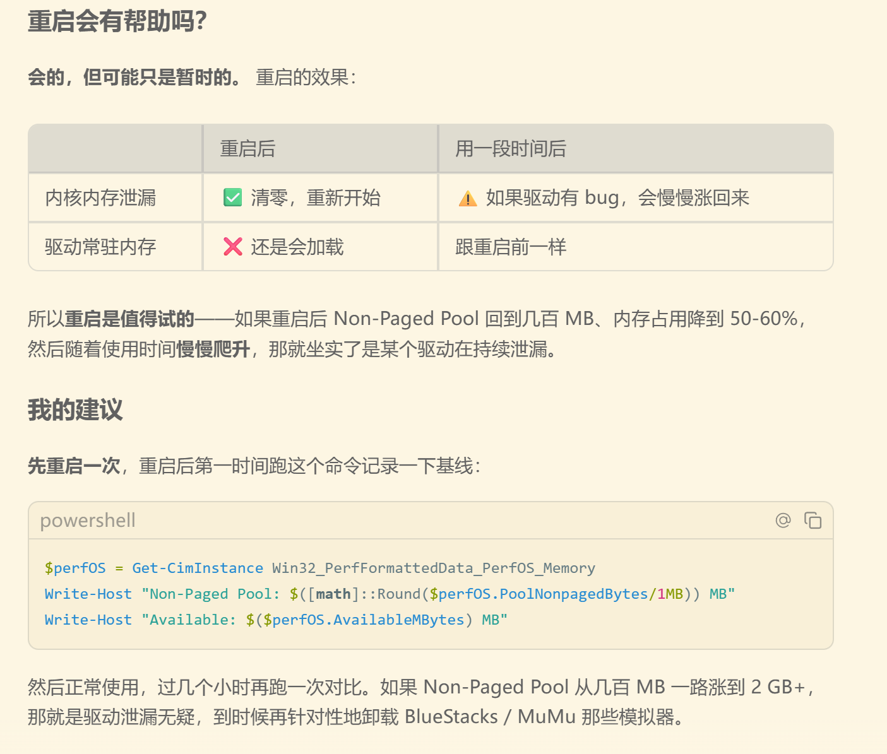
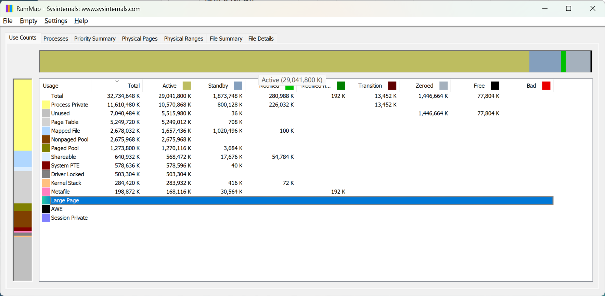
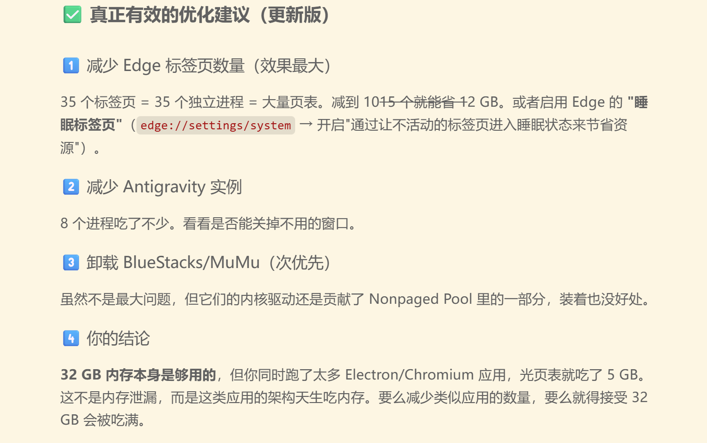
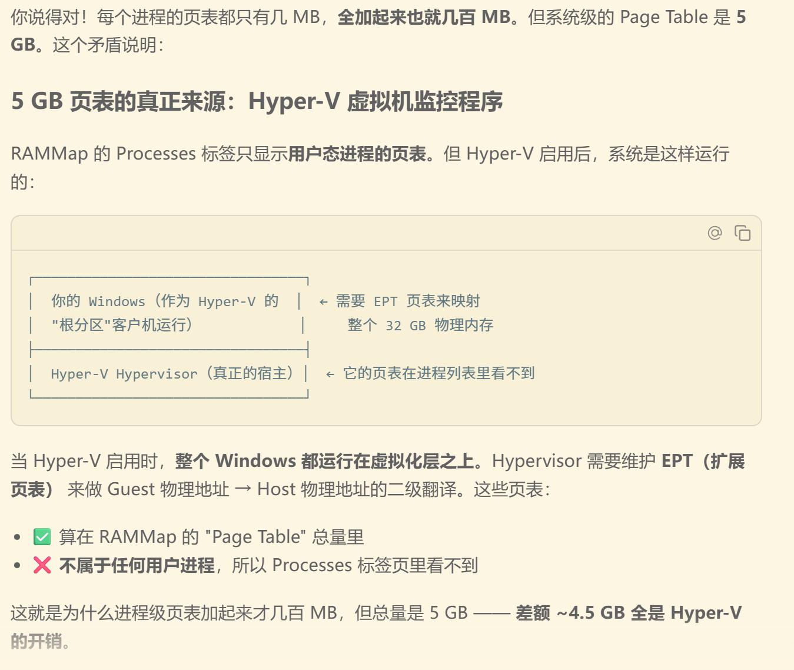
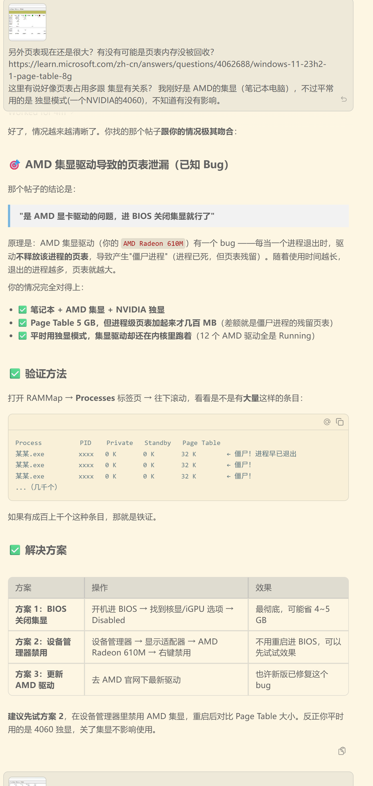
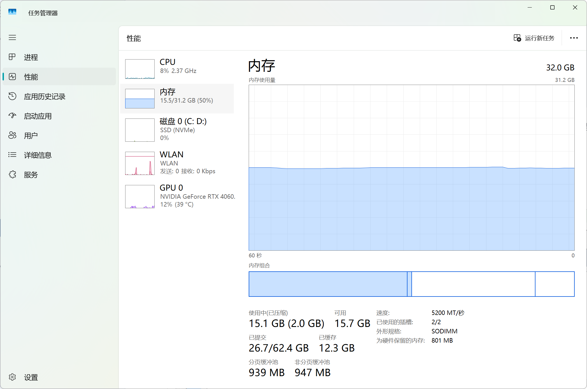
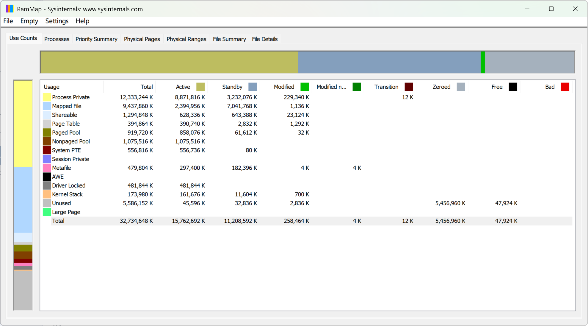

## 环境

机器：华硕天选 5 PRO 锐龙版(24年9月购入)

CPU：AMD Ryzen 9 7940HX

对应的核显：AMD Radeon (TM) 610M

驱动版本：32.0.11002.41(但AMD Software: Adrenalin Edition中似乎是显示24.xxx；软件已经卸载了，记不清)

系统：Windows 11

## 现象

启动一天后的电脑，开两个 IDEA 实例和 Antigravity 以及杂七杂八的软件之后，感觉明显卡顿，任务管理器中用户页面显示用户占用只有 10G 左右(这个占用不知道是测的是什么，后续发现跟RamMap里没有对的上的)，但是性能界面显示内存占用 99%左右。

以往也是，开机2~3天之后，即使什么软件也没开，内存占用也来到70%左右。

## 原因

AMD核显的驱动导致大量进程无法退出后成为僵尸进程，其页表驻留在物理内存中。
此外似乎这些进程也会占用一些内存，使其无法被回收。

[windows 11 23H2 不断产生僵尸进程，开机1天Page Table占用8G内存 - Microsoft Q&A](https://learn.microsoft.com/zh-cn/answers/questions/4062688/windows-11-23h2-1-page-table-8g)

[windows - How to identify a driver causing every exited process to become a zombie, polluting page table and active unused memory? - Super User](https://superuser.com/questions/1838566/how-to-identify-a-driver-causing-every-exited-process-to-become-a-zombie-pollut/1841601#1841601)

## 解决办法

设备管理器中，禁用 AMD Radeon (TM) 610M ，重启后问题解决。
或者尝试更新或者回退核显的版本，看看是否存在某个版本没有这个问题。

## 收获

RAMMap可以查看物理内存快照。

尽量不要相信AI在无信息/缺少信息情况下做出的判断。应该提高依靠自己和传统工具的比例，而不是纯依赖AI。

## 过程

以前也经常发现有内存泄漏，重启能缓解，就没折腾。3月4日这天不太想做正事，于是去询问群友，并习惯性地在提出问题之后想着自己尝试解决。

现在我对于一个不了解的领域，首先会去问AI。opus4.6在powershell里用命令搜集了当前的内存信息，提出WSL2默认占用50%内存()可能导致问题，以及Non-paged pool 占用2.5G 和 从总占用减去已知占用得到的7G未知占用，可能是驱动层面的内存泄露。

我修改WSL2内存配置、关闭vmmemwsl之后，内存占用没有明显变少。

AI在获取驱动列表(但未获取它们占用的内存信息)后，就认为是BlueStack、MuMu模拟器、VMware 驱动、Hyper-V这四者可能有冲突导致内存泄露，让我把不用的BlueStack和MuMu卸载。
以及建议我重启，说如果看到内存缓慢上升，说明是这些驱动的问题，于是要卸载其中几个。
然而我想如果重启，内存泄露又是从零开始积累，那当天肯定是找不到问题了，就没跟着做。

因为AI拿Non-paged pool说驱动泄露，我就质疑它们似乎也没占特别多，随后AI给出了对话中最有用的内容：“下载RAMMap查看内存快照，分析占用。”

我测试，在google搜索"windows 内存泄露诊断"，前几个搜索结果中，只有一篇付费看全文的csdn文章提到了rammap，但是这部分只在搜索结果的简介中出现，正文免费部分看不到。

搜索 "windows memory leak diagnosis" 或者 "windows memory leak detection"，搜索结果页面找关键字RAMMap，也只有一个Youtube视频有提，Windows 自家的教程直接让去用 poolmon 之类检测驱动泄露的工具。

其实Microsoft Learn里也有RAMMap的页面，不知道为什么搜索 memory leak，不会显示在前面。

也就是说，如果没有AI，我通过搜索引擎解决，大概率要折腾其他的一些工具。像，poolmon，后面AI有让我装，但是是tui，并且很多缩写，不明白意思，看不懂。

之后用RAMMap得到了如下信息。

Active是必须占用物理内存的部分。AI说Page Table异常，Nonpaged pool占用偏高。(与解决问题后的图做对比，我觉得这里Unused的Active部分也太高，猜想可能是僵尸进程占用，其实也不能使用(虽然名字是unused)，不知道怎么验证。)

然后这里opus4.6再一次进行了完全没证据的推断，直接从页表太大跳到认为是电脑上Chromium架构的进程太多(Edge、Antigravity、Obsidian)，所以页表占用这么大，告诉我关掉就好了。

但是我没那么容易信，因为任务管理器里，这几个软件占用都不高，而且从RAMMap的对各部分内存占用的命名上，我会认为任务管理器显示的这些软件的大部分内存占用应该在Process private而不是页表上。以及关闭所有软件之后，内存占用也只是恢复到60~70%左右，很难想象跑一个Windows 11要占用16G以上的内存。

于是质疑AI，随后它让我去Process界面，按Page Table大小倒序查看，发现占用最多的单个进程也才十几MB，截图中进程页表占用加起来也才100多MB。
被否定之后，AI马上又给出了信誓旦旦的结论，告诉我关掉Hyper-v就没事了。

我没辙了，打算就先卸载一下MuMu模拟器和BlueStack，因为确实没在使用，还有相应驱动，不使用也会加载，占用内存。

不过，最后还是带着“这台机器出来快两年了，应该有人遇到类似的问题吧”的想法，去edge搜索了一下"Page Table 占用太多内存"，而第一篇就是：

[windows 11 23H2 不断产生僵尸进程，开机1天Page Table占用8G内存 - Microsoft Q&A](https://learn.microsoft.com/zh-cn/answers/questions/4062688/windows-11-23h2-1-page-table-8g)（经测试，bing、google、baidu都能搜到，且排序在前。），然后在用户回答中找到了[windows - How to identify a driver causing every exited process to become a zombie, polluting page table and active unused memory? - Super User](https://superuser.com/questions/1838566/how-to-identify-a-driver-causing-every-exited-process-to-become-a-zombie-pollut/1841601#1841601)。虽然他们的标题都没有AMD这个关键词，不过确实就是我遇到的问题。

上述URL给AI，获取网页内容之后，AI还是给出了正确的回答：

去检查RAMMap发现，确实有上万甚至十万的只占几KB页表的进程。

再之后，由于在做此事而不想转去做正事，我继续尝试问AI解决Nonpaged pool过大的问题。AI让我用poolmon，这个得下微软一个很大的工具包才能用到。由于是工具是TUI，加上我不是很看得懂，最后一顿折腾，效果也不显著，只减少2~300MB(用命令关掉了几个 Windows Performance Recorder(WPR)的进程，为确认是否可以关，又与AI扯皮几轮，最后还是半信半疑地关掉了)。

最终效果：(在 IDEA 关闭的情况下。若是与原来相同的状态，大约是 70~80%内存占用，而原来是 90~99%)

## 感想

不过我想，Websearch功能在这里应该可以代替我。也许只是因为Antigravity的agent做得不好，不会让AI尝试在遇到问题时调用工具来搜集信息，而是会直接开始生成，所以才会有那么多错误方案。

AI会把猜想(当然在LLM的视角来看不算猜想吧，一切文字都是平等的)也说得像是事实，挺容易误导人。即使是现在最强的opus4.6也会这样。我不管是通过尝试它说的方案来确认是否有效还是通过思考推理来排除，其实都要消耗时间和精力(此外，阅读AI生成的内容来获取信息、建议本身也要消耗)。

但另一方面，也可以说AI需要有合适的上下文才能正确处理问题，以及减少幻觉。但是，这就像要求我在遇到问题的时候，脑子里一定装着相关的知识和信息，这也太难了。只能说再观望观望各厂商的工程师能做到什么程度吧。

AI的幻觉，特别是涉及经验性的判断、分析综合(事实性的描述倒是应该容易分辨，至少不确定可以搜索)，对没有经验的人来说极难分辨，而有经验的人，自己看信息就能得出类似结论，也不需要用AI吧。感觉这也可以是对某领域熟练的人，用AI可以提效，但是新手大概率浪费时间的一个佐证。
再就是也许是因为上下文污染，AI经常过于偏执，喜欢坚持无来由的结论，除非真的能跟它讲明白是错的(其实也是通过污染它的上下文来让它顺从吧...)。

全程使用 AI ，不过最后真正解决问题，还是靠分析工具(信息)和网友(解决方案)。AI在这里起到的作用就是解释计算机内存相关的概念问题，以及告知我有什么工具可以采集信息，以及帮我解读信息；但AI也给了很多错误的指引和方案。如果没有前人遇到相似的问题，我大概会在不断地跟AI扯皮之后精疲力竭。

